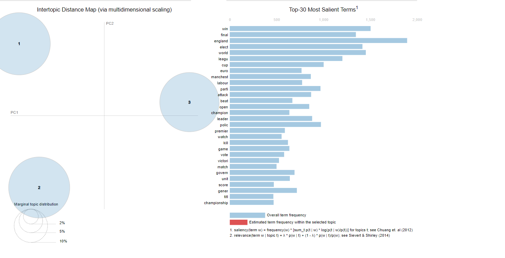

# Классификация новостей LDA на gensim

**Цель:** выделить темы и разделить датасет на темы.      
**Ход выполнения:**
1. Обработка данных через gensim
2. Обучение модели LDA на gensim
3. Посчитать метрику и визуализировать результат

## 1. Обработка данных через gensim
```python
from gensim.parsing.preprocessing import preprocess_string
tokenized_texts = [preprocess_string(text) for text in texts]

dictionary = Dictionary(tokenized_texts)

for text in tokenized_texts:
    if 'sai' in text:
        text.remove('sai')
    if 'peopl' in text:
        text.remove('peopl')
    if 'year' in text:
        text.remove('year')
    if 'bbc' in text:
        text.remove('bbc')
    if 'new' in text:
        text.remove('new')

corpus = [dictionary.doc2bow(text) for text in tokenized_texts]
```

> Я убрал самые популярные слова, которые есть почти во всех новостях

## 2. Обучение модели LDA на gensim
```python
lda_model = LdaModel(corpus=corpus, id2word=dictionary, num_topics=3)
```
> Путем визуального анализа, я понял, что лучшее число **num_topics** должно равняться 3

## 3. Посчитать метрику и визуализировать результат
> Я выбрал метрику UMass
Метрика UMass составила: -4.177533785442077

